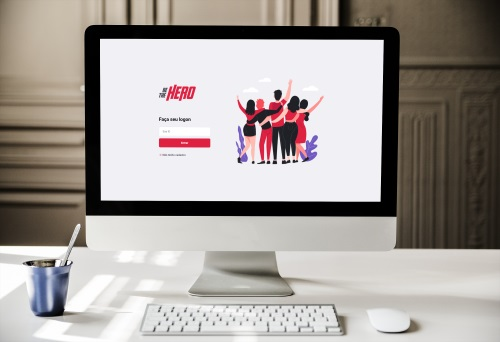

<h1 align="center">
    
</h1>

  

  

  

  

  <a aria-label="Completed" href="https://rocketseat.com.br/">
    </img>
  </a>
  

  

## 💻 About

The Be The Hero project was built on the OmniStack Week 11, an online event by [Rocketseat](https://rocketseat.com.br/) that demonstrates the power of Node, React and React Native.

Be The Hero is a project that connects people who are willing to help NGOs. Users can list NGOs information and choose to help on specific needs.

<h1 align="center">
    
</h1>

## :rocket: Technologies

This project was developed with:

- [Node.js](https://nodejs.org/en/)
- [Express](https://expressjs.com/)
- [React](https://reactjs.org)
- [React Native](https://facebook.github.io/react-native/)
- [Expo](https://expo.io/)

## 🔖 Layout

Layout was provided by [Rocketseat](https://rocketseat.com.br/), avaliable at [Figma](https://www.figma.com/file/2C2yvw7jsCOGmaNUDftX9n/Be-The-Hero---OmniStack-11?node-id=0%3A1).

## 🎯 New Features

The following features are not part of the original project, but were implemented by myself:

- [x] Refactored routes validation into new folder in backend;
- [ ] Made integration tests on all endpoints;
- [ ] Login using [JWT](https://jwt.io/);
- [ ] Light/Dark mode on web and mobile app;
- [ ] Edit an incident;

---

Made with ☕ and 🍺 by Davy Monteoliva  [Get in touch!](https://www.linkedin.com/in/dmonteoliva/) :wave: